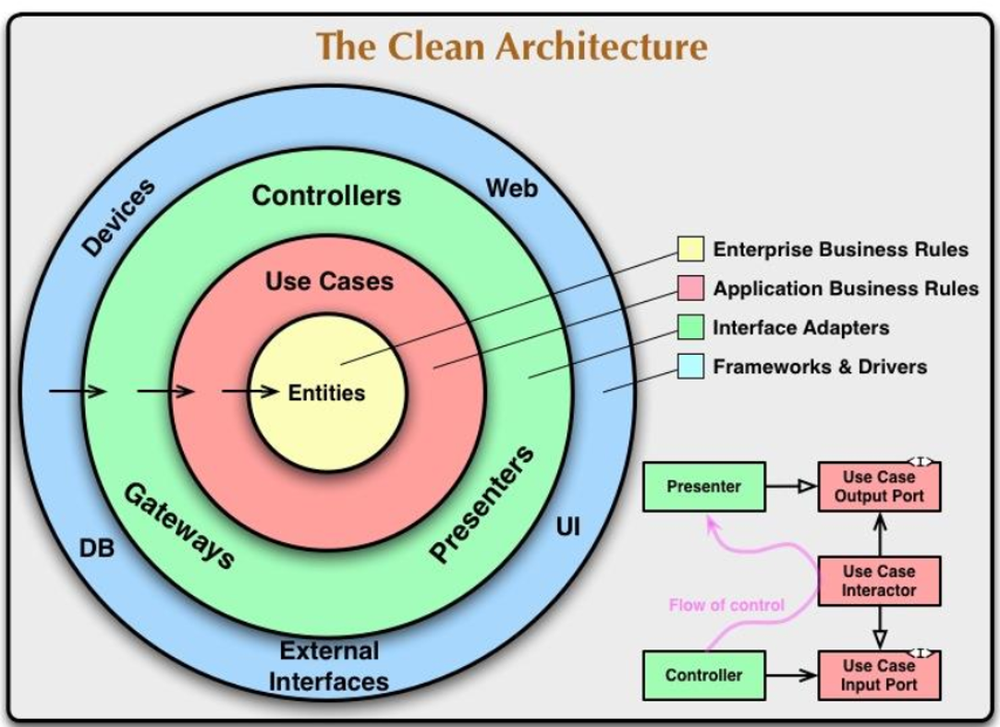
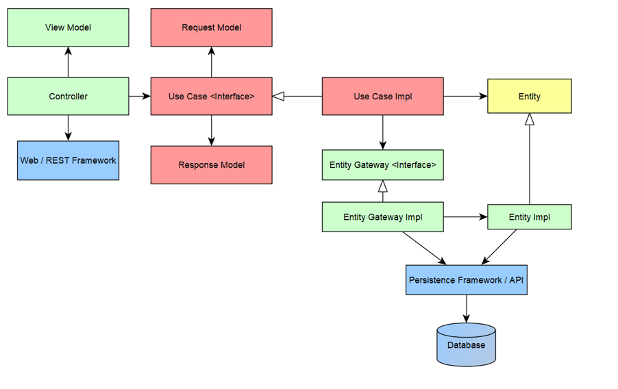

## Demo of an Online Store application using the principles of Clean Architecture

### Domain
Customer adds products to the shopping cart in this sample application of the online store. 

### Application Architecture 

The architecture of the web service Java application follows a [Clean Architecture](http://blog.cleancoder.com/uncle-bob/2012/08/13/the-clean-architecture.html). 
 As such, the core of the application itself is devoid of any delivery framework mechanisms and technology specific details. 
 I.e. Things like SQL and Spring MVC are kept outside of the boundary of the application. 
  It is developed in a use case centric approach,  JUnit  ensure the behaviour works in class isolation. 
  

   
### Simplified form of the Clean Architecture adaped in this example

